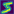
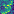

# Pojet MNIST with binary activations: Pytorch

We train a binary neral network. To train a neural network with discrete variables, we can use two methods: REINFORCE (E (Williams, 1992; Mnih & Gregor,2014) and the straight-through estimator (Hinton, 2012; Bengio et al., 2013).

## Open Binary MNIST V2 notebook:

## Results on MNIST:
### Loss/ACC:
|               Models: 2 conv layers (29k parameters)              	|      Loss      	|  Accuracy (%)  	|
|:-----------------------------------------------------------------:	|:--------------:	|:--------------:	|
| No binary models                                                  	|     **0.0341**     	|      **98.79**     	|
|:-----------------------------------------------------------------:	|:--------------:	|:--------------:	|
| Stochastic binary model in the first conv layer with ST           	|     0.0539     	|      98.29     	|
| Stochastic binary model in the last conv layer with ST            	|     **0.0534**     	|      **98.31**     	|
| Stochastic binary model in the both conv layer with ST            	|     0.0710     	|      97.54     	|
| Stochastic binary model in the first conv layer with REINFORCE    	|     0.0749     	|      97.56     	|
| Stochastic binary model in the last conv layer with REINFORCE     	|     1.2811     	|      88.95     	|
| Stochastic binary model in the both conv layer with REINFORCE     	|     3.2085     	|      80.68     	|
|:-----------------------------------------------------------------:	|:--------------:	|:--------------:	|
| Deterministic binary model in the first conv layer with ST        	|     **0.03912**    	|      **98.65**     	|
| Deterministic binary model in the last conv layer with ST         	|     0.0743     	|      97.81     	|
| Deterministic binary model in the both conv layer with ST         	|     0.0745     	|      97.57     	|
| Deterministic binary model in the first conv layer with REINFORCE 	|     0.0684     	|      97.76     	|
| Deterministic binary model in the last conv layer with REINFORCE  	|     0.5569     	|      95.42     	|
| Deterministic binary model in the both conv layer with REINFORCE  	|     0.8538     	|      93.40     	|

### Heatmap:
heatmap No binary network, conv layer1:

heatmap Stochastic binary network with ST, conv layer1:

### Slope Annealing explicaion:
Extract from : ["HIERARCHICAL MULTISCALE RECURRENT NEURAL NETWORKS", Junyoung Chung, Sungjin Ahn & Yoshua Bengio (Mar 2017).](https://arxiv.org/pdf/1609.01704.pdf) :

" Training neural networks with discrete variables requires more efforts since the standard backpropagation is no longer applicable due to the non-differentiability. Among a few methods for training a neural network with discrete variables such as the REINFORCE (Williams, 1992; Mnih & Gregor,2014) and the straight-through estimator (Hinton, 2012; Bengio et al., 2013). [...]
The straight-through estimator is a biased estimator because the non-differentiable function used in the forward pass (i.e., the step function in our case) is replaced by a differentiable function during the backward pass (i.e., the hard sigmoid function in our case). The straight-through estimator, however, is much simpler and often works more efficiently in practice than other unbiased but high-variance estimators such as the REINFORCE. The straight-through estimator has also been used in Courbariaux et al. (2016) and Vezhnevets et al. (2016).

The Slope Annealing Trick. In our experiment, we use the slope annealing trick to reduce the bias of the straight-through estimator. The idea is to reduce the discrepancy between the two functions used during the forward pass and the backward pass. That is, by gradually increasing the slope a of the hard sigmoid function, we make the hard sigmoid be close to the step function. Note that starting with a high slope value from the beginning can make the training difficult while it is more applicable later when the model parameters become more stable. In our experiments, starting from slope a = 1, we slowly increase the slope until it reaches a threshold with an appropriate scheduling. "

# References: 
* most of the code for this repository comes from this repository: [Wizaron/binary-stochastic-neurons](https://github.com/Wizaron/binary-stochastic-neurons).
* ["HIERARCHICAL MULTISCALE RECURRENT NEURAL NETWORKS", Junyoung Chung, Sungjin Ahn & Yoshua Bengio (Mar 2017).](https://arxiv.org/pdf/1609.01704.pdf)
*   

